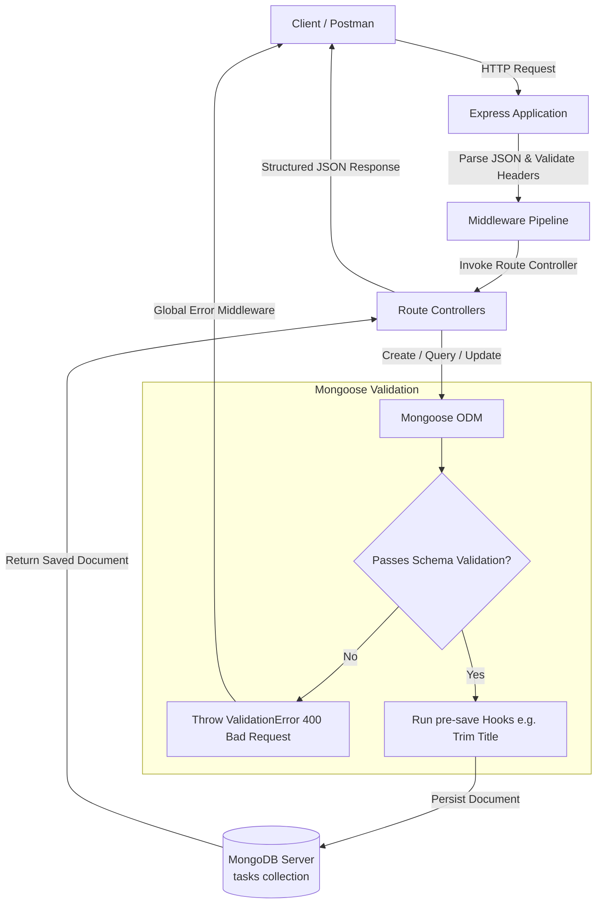

# Practical 5: MongoDB Integration and Schema Design with Mongoose

**CO/PO Mapping:** CO2, CO3 / PO3, PO5

## Objective

To connect a MongoDB database to an Express server and enforce data validation through Mongoose schema.

---

## Prerequisites

- **Practical 4 completed:** Working Express server with in-memory CRUD operations.
- **Basic understanding of NoSQL/document-based data:** Collections and BSON documents versus relational tables, rows, and primary keys.

---

## Theory Concepts (Self-Study Reference)

### Coursera Pointer
> See **Week 5 IBM: Node.js & MongoDB Developing Back-end Database Applications**, Module 2 (*Data and databases intro, MongoDB CRUD operations, Mongoose schema design and validation*).

### Key Theoretical Pillars

1. **Relational (SQL) vs. Document (NoSQL):**
   - In SQL, tables enforce a rigid column structure with foreign keys.
   - In MongoDB, data is stored in flexible, JSON-like BSON (Binary JSON) documents grouped into collections.
2. **Object Data Modeling (ODM) with Mongoose:**
   - Mongoose provides an abstraction layer over MongoDB's native driver, introducing schemas, models, type casting, validation, and lifecycle hooks.
3. **Application-Level Schema Enforcement:**
   - While MongoDB is natively schema-less (any document can store arbitrary fields), Mongoose enforces structured validation rules in the Node.js application tier before documents reach the database.
4. **Middleware / Lifecycle Hooks:**
   - Pre-hooks (`pre('save')`) and post-hooks allow logic (such as sanitization, trimming, hashing, or logging) to execute during document lifecycle events.

---

## Architecture / Diagram

```text
       +-------------------------------------------------------------+
       |                     Client / Postman                        |
       +-------------------------------------------------------------+
                                      |
                                      | HTTP Request (JSON Body)
                                      v
       +-------------------------------------------------------------+
       |                        Express App                          |
       |  - express.json() Body Parser                               |
       |  - Request Logger Middleware                                |
       |  - Content-Type Validation Middleware                       |
       |  - Route Handlers (/tasks, /tasks/:id)                      |
       +-------------------------------------------------------------+
                                      |
                                      | Query / Mutation
                                      v
       +-------------------------------------------------------------+
       |                       Mongoose ODM                          |
       |  - Task Schema Validation (Types, Required, Enum)           |
       |  - Pre-save Hook (Auto-trim whitespace)                     |
       |  - Model Operations: find, create, findByIdAndUpdate, etc.  |
       +-------------------------------------------------------------+
                                      |
                                      | BSON Protocol
                                      v
       +-------------------------------------------------------------+
       |                      MongoDB Database                       |
       |                    task_manager_db                          |
       |                           |                                 |
       |                           +---> tasks collection            |
       |                                 {                           |
       |                                   _id: ObjectId(...),       |
       |                                   title: String,            |
       |                                   description: String,      |
       |                                   completed: Boolean,       |
       |                                   priority: String,         |
       |                                   createdAt: Date           |
       |                                 }                           |
       +-------------------------------------------------------------+
```



---

## Problem Definition

### Problem Statement

- Extend the Task Management backend from Practical 4 by connecting MongoDB using Mongoose.
- Define a Task schema with at least 4 fields: `title` (String, required), `description` (String), `completed` (Boolean, default `false`), `createdAt` (Date, default `Date.now`).
- Replace the in-memory array from Practical 4 with real Mongoose model operations.
- Test all CRUD operations against the live database using Postman or an automated HTTP test runner.
- Ensure validation errors are returned as structured JSON, not raw Mongoose error objects.

---

## Key Questions & Analysis

### 1. What is the purpose of a schema in a NoSQL database like MongoDB, given that MongoDB itself is schema-less?
Even though MongoDB permits storing heterogeneous documents in the same collection, enterprise software requires predictability, data integrity, and consistent API contracts. A Mongoose schema acts as an application-level contract that guarantees:
- Every stored document conforms to agreed field types (Strings, Booleans, Dates).
- Required attributes are never omitted.
- Invalid data types are caught before persisting to storage.
- Business rules, default values, and sanitized formatting remain uniform across all server operations.

### 2. Why is it important to define required fields and default values at the schema level rather than relying on frontend validation alone?
Frontend validation is purely for user experience (giving immediate visual feedback in forms). It cannot guarantee data integrity because:
- Attackers or third-party clients can bypass frontend code entirely using tools like Postman, `curl`, or scripts.
- Multiple client applications (web, mobile apps, CLI tools) may access the same backend; duplicating validation logic across every client leads to drift and bugs.
- Defining rules in the Mongoose schema ensures that the database access layer is protected regardless of where the request originated.

### 3. What happens internally when a document fails Mongoose validation — where is the request stopped?
When an operation like `Task.create()` or `document.save()` runs:
1. Mongoose executes document validation locally in Node.js before sending any query to MongoDB.
2. It evaluates all schema constraints (e.g. `required`, `enum`, `minlength`, custom validators).
3. If any constraint fails, Mongoose halts execution immediately and generates a `ValidationError` object containing individual validation errors for each failed path.
4. **No network round-trip or write command is sent to the MongoDB server.**
5. The rejected promise is caught in the route controller's `catch(error)` block, which invokes `next(error)` to pass control to the Express centralized error-handling middleware.

---

## Supplementary Problems Implemented

### 1. Priority Enum Field
Added a `priority` field to `taskSchema` restricted to an enum of `['low', 'medium', 'high']` with a default of `'medium'`:
```javascript
priority: {
  type: String,
  enum: {
    values: ["low", "medium", "high"],
    message: "Priority must be either low, medium, or high",
  },
  default: "medium",
}
```

### 2. Pre-save Title Trim Hook
Added a pre-save document hook that automatically strips leading and trailing whitespace from the `title` field before saving:
```javascript
taskSchema.pre("save", function () {
  if (typeof this.title === "string") {
    this.title = this.title.trim();
  }
});
```

### 3. Single Resource GET Endpoint with 404 & 400 Handling
Implemented `GET /tasks/:id` to retrieve a single task document. If the task ID is not found, a clean `404 Not Found` JSON response is returned. If the ID is not a valid 24-character hex MongoDB ObjectId, a `400 Bad Request` JSON response is returned:
```javascript
app.get("/tasks/:id", validateObjectId, async (req, res, next) => {
  try {
    const task = await Task.findById(req.params.id);
    if (!task) {
      return res.status(404).json({ error: "Task not found" });
    }
    res.status(200).json({ message: "Task fetched successfully", data: task });
  } catch (error) {
    next(error);
  }
});
```

---

## Key Skills Addressed

- Connecting a Node/Express backend to MongoDB using Mongoose.
- Designing schema definitions with data types, required constraints, default values, and enums.
- Creating lifecycle middleware hooks (`pre('save')`) for automated data transformation.
- Performing persistent CRUD operations using Mongoose model methods (`find()`, `findById()`, `create()`, `findByIdAndUpdate()`, `findByIdAndDelete()`).
- Intercepting and formatting Mongoose validation and cast errors into structured, user-friendly JSON responses.

---

## Technologies Used

- **Node.js:** JavaScript runtime environment (v18+)
- **Express.js:** Web application framework (v4.21.2)
- **Mongoose:** Object Data Modeling (ODM) library for MongoDB (v9.10.1)
- **MongoDB Server:** Local Community Server v8.0.11 running on port `27017`
- **dotenv:** Environment variable management
- **Postman / REST Client / Node Test Runner:** API testing and validation

---

## Project Structure

```text
task-manager-api/
|
+-- models/
|   +-- Task.js             # Mongoose Task Schema, validations, hooks, and model
|
+-- .env                    # Environment variables (PORT, MONGO_URI) [git-ignored]
+-- .env.example            # Environment configuration template
+-- package.json            # Dependencies and scripts (start, test)
+-- package-lock.json       # Exact dependency lockfile
+-- server.js               # Express application, MongoDB connection, routes, error handlers
+-- test-api.js             # Automated end-to-end CRUD and validation test suite
```

---

## Lab Session Step-by-Step

### Step 1: Install Mongoose & dotenv, Setup Environment Variables
Installed packages inside `task-manager-api`:
```bash
npm install mongoose dotenv
```

Created `.env` and `.env.example`:
```ini
PORT=5000
MONGO_URI=mongodb://127.0.0.1:27017/task_manager_db
```

### Step 2: Connect Express to MongoDB in `server.js`
```javascript
const mongoose = require("mongoose");
require("dotenv").config();

const MONGO_URI = process.env.MONGO_URI || "mongodb://127.0.0.1:27017/task_manager_db";

mongoose
  .connect(MONGO_URI)
  .then(() => console.log("MongoDB connected successfully"))
  .catch((err) => console.error("MongoDB connection error:", err.message));
```

### Step 3: Define Task Schema and Model in `models/Task.js`
```javascript
const mongoose = require("mongoose");

const taskSchema = new mongoose.Schema(
  {
    title: {
      type: String,
      required: [true, "Task title is required"],
      trim: true,
    },
    description: {
      type: String,
      default: "",
      trim: true,
    },
    completed: {
      type: Boolean,
      default: false,
    },
    priority: {
      type: String,
      enum: {
        values: ["low", "medium", "high"],
        message: "Priority must be either low, medium, or high",
      },
      default: "medium",
    },
    createdAt: {
      type: Date,
      default: Date.now,
    },
  },
  {
    versionKey: false,
  }
);

// Pre-save hook to trim whitespace from title
taskSchema.pre("save", function () {
  if (typeof this.title === "string") {
    this.title = this.title.trim();
  }
});

module.exports = mongoose.model("Task", taskSchema);
```

### Step 4: Replace In-Memory Logic with Mongoose Model Methods
- `Task.find().sort({ createdAt: -1 })` retrieves all tasks sorted by creation date.
- `Task.findById(req.params.id)` finds a single task.
- `Task.create(req.body)` creates and validates a new document.
- `Task.findByIdAndUpdate(req.params.id, req.body, { returnDocument: 'after', runValidators: true })` updates and re-validates.
- `Task.findByIdAndDelete(req.params.id)` removes the document.

### Step 5: Structured Validation and Error Handling Middleware
```javascript
app.use((err, req, res, next) => {
  // Capture Mongoose validation failures
  if (err.name === "ValidationError") {
    const details = Object.values(err.errors).map((item) => item.message);
    return res.status(400).json({
      error: "Validation Error",
      details,
    });
  }

  // Capture malformed MongoDB ObjectIds
  if (err.name === "CastError") {
    return res.status(400).json({
      error: "Invalid task ID format",
    });
  }

  console.error("Unhandled Error:", err);
  res.status(500).json({
    error: "Internal Server Error",
  });
});
```

---

## API Routes & Payloads

### 1. Get All Tasks
- **Route:** `GET /tasks`
- **Response Code:** `200 OK`
- **Response Body:**
```json
{
  "message": "Tasks fetched successfully",
  "count": 1,
  "data": [
    {
      "_id": "6aab90c7e92f627390cfcef6",
      "title": "Learn Mongoose Schemas and Validation",
      "description": "Practical 5 MongoDB integration with Express",
      "completed": false,
      "priority": "high",
      "createdAt": "2026-09-17T07:03:35.440Z"
    }
  ]
}
```

### 2. Get Task by ID
- **Route:** `GET /tasks/:id`
- **Response Code:** `200 OK` (or `404 Not Found` if missing)
- **Response Body:**
```json
{
  "message": "Task fetched successfully",
  "data": {
    "_id": "6aab90c7e92f627390cfcef6",
    "title": "Learn Mongoose Schemas and Validation",
    "description": "Practical 5 MongoDB integration with Express",
    "completed": false,
    "priority": "high",
    "createdAt": "2026-09-17T07:03:35.440Z"
  }
}
```

### 3. Create Task
- **Route:** `POST /tasks`
- **Request Headers:** `Content-Type: application/json`
- **Request Body:**
```json
{
  "title": "   Complete MongoDB Lab   ",
  "description": "Connect Mongoose schema and test validation",
  "priority": "high"
}
```
- **Response Code:** `201 Created`
- **Response Body:** *(Title trimmed automatically by pre-save hook)*
```json
{
  "message": "Task created successfully",
  "data": {
    "_id": "6aab90d1f81a7b8e19203a11",
    "title": "Complete MongoDB Lab",
    "description": "Connect Mongoose schema and test validation",
    "completed": false,
    "priority": "high",
    "createdAt": "2026-09-17T07:04:10.120Z"
  }
}
```

### 4. Validation Error Response (Missing Title or Invalid Priority)
- **Route:** `POST /tasks`
- **Request Body:**
```json
{
  "description": "No title given",
  "priority": "urgent"
}
```
- **Response Code:** `400 Bad Request`
- **Structured Error Response:**
```json
{
  "error": "Validation Error",
  "details": [
    "Task title is required",
    "Priority must be either low, medium, or high"
  ]
}
```

### 5. Update Task
- **Route:** `PUT /tasks/:id`
- **Request Body:**
```json
{
  "completed": true,
  "priority": "low"
}
```
- **Response Code:** `200 OK`
- **Response Body:**
```json
{
  "message": "Task updated successfully",
  "data": {
    "_id": "6aab90d1f81a7b8e19203a11",
    "title": "Complete MongoDB Lab",
    "description": "Connect Mongoose schema and test validation",
    "completed": true,
    "priority": "low",
    "createdAt": "2026-09-17T07:04:10.120Z"
  }
}
```

### 6. Delete Task
- **Route:** `DELETE /tasks/:id`
- **Response Code:** `200 OK`
- **Response Body:**
```json
{
  "message": "Task deleted successfully",
  "data": {
    "_id": "6aab90d1f81a7b8e19203a11",
    "title": "Complete MongoDB Lab",
    "description": "Connect Mongoose schema and test validation",
    "completed": true,
    "priority": "low",
    "createdAt": "2026-09-17T07:04:10.120Z"
  }
}
```

---

## Verification & Testing

### Automated Test Suite
An automated test script `test-api.js` is included in the project to verify all CRUD endpoints, error states, and schema constraints:
```bash
npm test
```

### Test Results Summary

| # | Test Scenario | Expected Status | Result |
|---|---------------|-----------------|--------|
| 1 | POST /tasks without title | `400 Bad Request` | Structured JSON: `"Task title is required"` |
| 2 | POST /tasks with invalid priority | `400 Bad Request` | Structured JSON: `"Priority must be either low, medium, or high"` |
| 3 | POST /tasks with padded title | `201 Created` | Title whitespace trimmed by pre-save hook |
| 4 | GET /tasks | `200 OK` | Retrieved all documents from MongoDB collection |
| 5 | GET /tasks/:id (valid ID) | `200 OK` | Retrieved single matching document |
| 6 | GET /tasks/:id (non-existent ID) | `404 Not Found` | Structured JSON: `"Task not found"` |
| 7 | GET /tasks/:id (malformed ID) | `400 Bad Request` | Structured JSON: `"Invalid task ID format"` |
| 8 | PUT /tasks/:id (valid update) | `200 OK` | Document updated in database |
| 9 | PUT /tasks/:id (invalid priority) | `400 Bad Request` | Rejected via `runValidators: true` |
| 10 | DELETE /tasks/:id | `200 OK` | Document deleted from database |
| 11 | Subsequent GET after DELETE | `404 Not Found` | Confirmed permanent deletion |
| 12 | Server Restart Persistence | Data Persisted | Documents survive server restarts |

---

## Learning Outcome

Students will be able to:
- Connect an Express.js application to a MongoDB database using Mongoose.
- Design strongly-typed schemas enforcing required constraints, default values, and enums.
- Implement document lifecycle hooks (`pre('save')`) to preprocess data automatically.
- Perform robust CRUD operations using Mongoose model methods.
- Format database validation exceptions into clean, structured JSON responses for client consumption.
